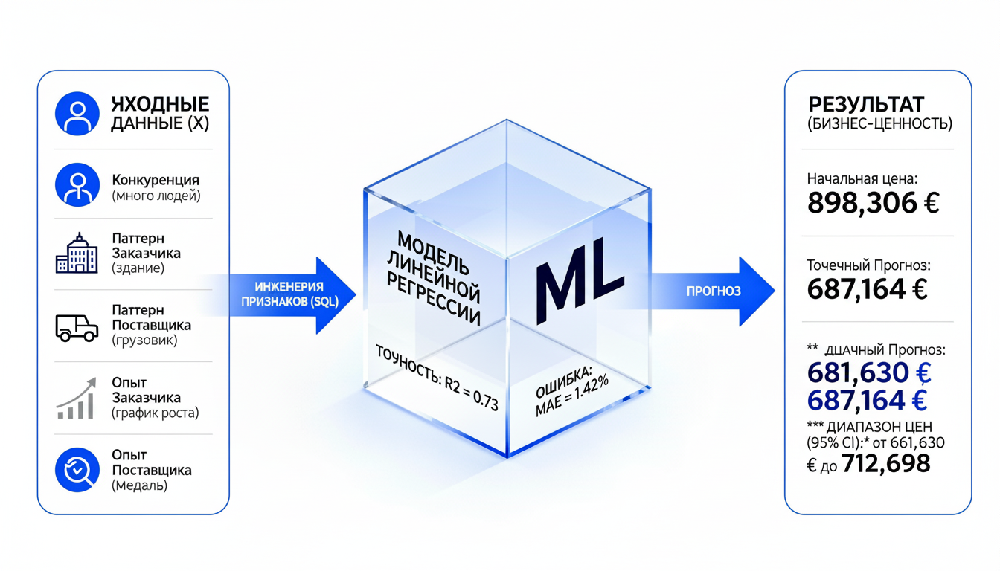
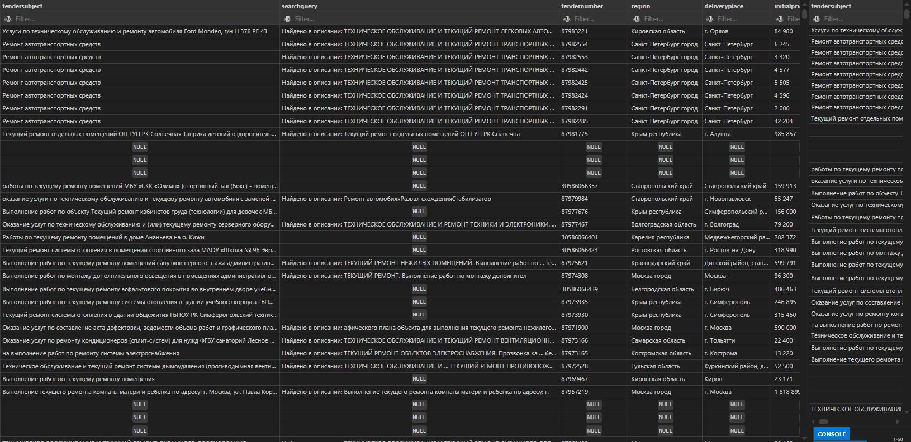
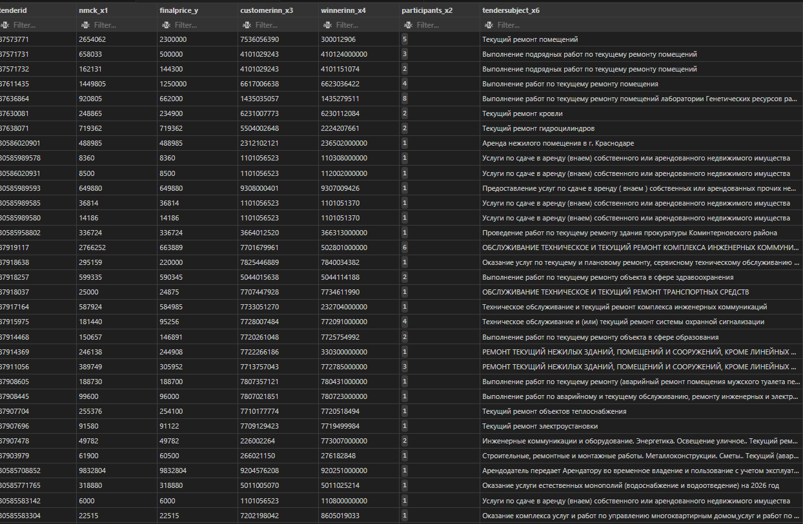

# 🚀 Проект: Прогнозирование Финальной Цены Контракта (Тендерный Анализ)

## 🎯 Введение и Бизнес-Задача (Introduction & Problem Statement)

Этот проект посвящен созданию модели машинного обучения для точного прогнозирования **процента снижения Начальной Максимальной Цены Контракта (НМЦК)** в секторе государственных закупок (44-ФЗ/223-ФЗ).

**Бизнес-Ценность:** Модель разработана для **Поставщиков**. Она позволяет **в процессе торгов**, после того как стали известны все участники (включая Заказчика и потенциальных конкурентов), определить наиболее вероятный **диапазон финальной цены контракта**. Используя исторические паттерны поведения этих игроков, Поставщик может принять **стратегически обоснованное решение** о своем ценовом предложении, избегая чрезмерного демпинга и максимизируя прибыль.
### 1. Источник Данных и Критерии Поиска

Данные для проекта были получены с платформы **тендерного агрегатора** [https://rostender.info/](https://rostender.info/).

Для доступа к историческим данным за выбранный период была оформлена **подписка на один месяц**.

**Вектор Поиска (Ключевые Слова и Отрасль):**

Проект сфокусирован на тендерах с высокой **конкуренцией**, что позволяет создать **сильный прогностический признак** (`NumParticipants`), который определяет конечную цену.

* **Ключевые слова для поиска (тематика):**
    * Ремонт и обслуживание зданий
    * Услуги по аренде (внаем) собственности
    * Эксплуатационные расходы
    * Текущий ремонт
* **Отрасль:**
    * Управление многоквартирными домами, комплексное техническое обслуживание зданий
## 💡 Идея Проекта и Инженерный Подход (The Project Idea & Engineering)

### Основная Гипотеза

Идея проекта строится на гипотезе о том, что **прогноз финальной цены** не должен делаться **"наугад"**, а должен основываться на **анализе исторической статистики** и поведения ключевых игроков.

Мы предполагаем, что **историческое поведение ключевых игроков** (Заказчика и Поставщика), в сочетании с моментальными характеристиками торгов (как количество участников), даёт надёжную основу для прогнозирования. Это позволяет перейти от интуитивных решений к решениям, основанным на **количественных данных**.

**Следовательно, задача** заключалась в том, чтобы трансформировать базовые входные поля в **сложные агрегированные признаки**, которые несут в себе информацию о прошлом опыте.

### 1. Входные Поля и Их Трансформация в Признаки ($\mathbf{X}$)

Начальные сырые поля из базы данных (наши **входные данные**) были преобразованы в следующие **прогностические признаки (факторы $\mathbf{X}$)** для регрессионного анализа:

| Входное Сырое Поле | Преобразованный Признак ($\mathbf{X}$) | Роль и Метод Агрегации |
| :--- | :--- | :--- |
| **`TenderNumber`** | `TenderID` | **Уникальный идентификатор**. Исключен из моделирования. |
| **`InitialPriceRub`** | `NMCK` | **Начальная Максимальная Цена Контракта**. Исключен из $\mathbf{X}$, используется для финального расчета цены. |
| **`ContractPriceRub`** | `Y_Reduction_Percent` | **Целевая Переменная ($\mathbf{Y}$)**. Рассчитана как: $100 \times (1 - \frac{\text{FinalPrice}}{\text{NMCK}})$. |
| **`ApplicationsCount`** | **`NumParticipants`** | **Квантифицированная Конкуренция**. Прямое использование (после приведения к типу `INTEGER`). Это **самый сильный** прогностический фактор. |
| **`CustomerINN`** | **`CustReduction_By_Industry`** | **Паттерн Поведения Заказчика**. Рассчитан через `AVG` исторического снижения, которое этот Заказчик получал по всем своим предыдущим торгам. |
| **`CustomerINN`** | **`CustTendersInIndustry`** | **Опыт Заказчика**. Рассчитан через `COUNT` общего количества завершенных тендеров. |
| **`WinnerINN`** | **`SupplierReduction_By_Industry`** | **Паттерн Поведения Поставщика**. Рассчитан через `AVG` исторического снижения, которое этот Поставщик давал по всем своим победам. |
| **`WinnerINN`** | **`SupplierWinsInIndustry`** | **Опыт Поставщика**. Рассчитан через `COUNT` общего количества побед в нише. |

### 2. Ключевой Инженерный Вывод

Наши 5 прогностических факторов X позволили модели Линейной Регрессии объяснить **73.14%** (**R^2$**) вариативности в конечной цене контракта, что подтвердило, что **исторические паттерны** являются высокоэффективным инструментом прогнозирования.

### Вопросы, на которые мы отвечали:

1.  Какие **исторические паттерны** (поведение заказчиков и поставщиков) являются самыми сильными прогностическими признаками?
2.  Как **конкуренция** (количество участников) влияет на процент снижения цены?
3.  Насколько точным может быть прогноз цены (метрики **R2** и **MAE**)?
4.  Какой **Доверительный Интервал (95% CI)** можно дать для прогнозируемой цены?

## 🛠️ Используемые Инструменты (Tools I Used)

-   **SQL (PostgreSQL):** Основа для извлечения данных, их очистки и создания **прогностических признаков (Feature Engineering)**.
-   **Python 3.x:** Основная среда для моделирования.
-   **Scikit-learn:** Обучение модели **Линейной Регрессии**, масштабирование (`StandardScaler`).
-   **Pandas & NumPy:** Обработка и трансформация данных.
-   **Git & GitHub:** Версионный контроль и публикация проекта.


---
## 🖼️ Инфографика Проекта: Пайплайн Прогнозирования

Для наглядного представления методологии проекта мы разработали инфографику, которая показывает, как сырые данные трансформируются в конечный, измеримый прогноз.



---

### 1. Этапы Пайплайна (Pipeline Breakdown)

| Блок Инфографики | Описание | Инструмент |
| :--- | :--- | :--- |
| **ВХОДНЫЕ ДАННЫЕ (X)** | Сырые поля (`NMCK`, `CustomerINN`, `ApplicationsCount`). На этом этапе мы идентифицируем **5 ключевых прогностических факторов**. | Ростендер (Источник) |
| **ИНЖЕНЕРИЯ ПРИЗНАКОВ (SQL)** | **Критический аналитический этап.** Здесь происходит очистка данных и **агрегация** исторических паттернов Заказчика и Поставщика с помощью `GROUP BY` и `AVG`. | **PostgreSQL (SQL)** |
| **МОДЕЛЬ ЛИНЕЙНОЙ РЕГРЕССИИ (ML)** | Обучение модели для прогнозирования целевой переменной $\mathbf{Y}$ (процент снижения). Достигнута высокая точность: **$R^2 = 0.73$** и **$\text{MAE} = 1.42\%$**. | Python (Scikit-learn) |
| **РЕЗУЛЬТАТ (БИЗНЕС-ЦЕННОСТЬ)** | Финальный прогноз. Предоставляется не только точечное значение, но и **Доверительный Интервал (95% CI)**, что критически важно для принятия бизнес-решений. | Python/Статистика |

---

## 💾 Этап 1: Очистка и Трансформация Данных (SQL Data Wrangling)

На этом этапе сырые текстовые данные преобразовывались в корректные числовые (`NUMERIC`), целочисленные (`INTEGER`) и датовые (`DATE`) типы, устраняя ошибки форматирования (символы валют, научная нотация ИНН, служебные слова в датах).
---

## 1. Входные Поля и Их Трансформация в Признаки ($\mathbf{X}$)

| Входное Сырое Поле   | Преобразованный Признак ($\mathbf{X}$) | Роль и Метод Агрегации                                                                                   |
|----------------------|----------------------------------------|---------------------------------------------------------------------------------------------------------|
| TenderNumber         | TenderID                               | Уникальный идентификатор.                                                                               |
| ContractPriceRub     | Y_Reduction_Percent                    | Целевая Переменная ($\mathbf{Y}$). Рассчитывается как:                                                  |
|                      |                                        | $$\mathbf{Y} = 100\% \times \left(1 - \frac{\text{FinalPrice}}{\text{NMCK}}\right)$$                      |
| ApplicationsCount    | NumParticipants                        | Квантифицированная Конкуренция. Текущий ключевой прогностический фактор.                                |
| CustomerINN          | CustomerINN_X3                        | ИНН Заказчика. Резерв для Feature Engineering.                                                         |
| WinnerINN            | WinnerINN_X4                          | ИНН Победителя. Резерв для Feature Engineering.                                                        |

---

### 1. Создание Чистой Мастер-Таблицы

Для начала мы создали чистую таблицу `MasterTenders_10_4`, готовую к приему преобразованных данных.

## 🛠️ Методология: SQL Очистка и Первичное Моделирование (MVP)

### 1. Создание Таблиц и Очистка Данных (Data Wrangling)
``` sql
CREATE TABLE public.RawData_2025_10_4 (
    TenderSubject TEXT,                 -- Предмет тендера
    SearchQuery TEXT,                   -- Поиск
    TenderNumber TEXT,                  -- Номер тендера (X_ID)
    Region TEXT,                        -- Регион
    DeliveryPlace TEXT,                 -- Место поставки
    InitialPriceRub TEXT,               -- Начальная цена, руб (X1)
    AdvancePayment TEXT,                -- Аванс
    BidSecurityRub TEXT,                -- Обеспечение заявки, руб
    ContractSecurityRub TEXT,           -- Обеспечение контракта, руб
    CustomerName TEXT,                  -- Заказчик
    CustomerINN TEXT,                   -- ИНН заказчика (X3)
    OrganizerContactPerson TEXT,        -- Контактное лицо организатора
    OrganizerPhone TEXT,                -- Телефон организатора
    OrganizerEmail TEXT,                -- Электронная почта организатора
    OrganizerFax TEXT,                  -- Факс организатора
    SourceLink TEXT,                    -- Ссылка на источник
    EISNumber TEXT,                     -- Номер ЕИС
    ETPNumber TEXT,                     -- Номер ЭТП
    PurchaseType TEXT,                  -- Тип закупки
    PlacementMethod TEXT,               -- Способ размещения
    Stage TEXT,                         -- Этап
    PublicationDateMSK TEXT,            -- Дата публикации (МСК)
    ChangeDateMSK TEXT,                 -- Дата изменения (МСК)
    EndDateMSK TEXT,                    -- Дата окончания (МСК)
    OfferDeadlineMSK TEXT,              -- Окончание подачи предложений (МСК)
    BiddingStartTimeMSK TEXT,           -- Начало торгов (МСК)
    BiddingEndTimeMSK TEXT,             -- Завершение торгов (МСК)
    ResultsDateMSK TEXT,                -- Подведение итогов (МСК) (X8)
    ApplicationsCount TEXT,             -- Количество заявок (X2)
    RejectedApplicationsCount TEXT,     -- Количество отклонённых заявок
    MinimumPriceDeclared TEXT,          -- Минимальная заявленная цена
    WinnerName TEXT,                    -- Победитель
    WinnerINN TEXT,                     -- ИНН победителя (X4)
    WinnerPhone TEXT,                   -- Телефон победителя
    WinnerEmail TEXT,                   -- Электронная почта победителя
    WinnerPriceRub TEXT,                -- Цена победителя, руб
    ContractPriceRub TEXT,              -- Цена контракта, руб (Y)
    Tags TEXT,                          -- Метки (X6)
    LastComment TEXT,                   -- Последний комментарий
    Sectors TEXT                        -- Отрасли
);
CREATE TABLE MasterTenders_10_4 (
    TenderID TEXT PRIMARY KEY,       -- Уникальный номер тендера (Ключ)
    NMCK_X1 NUMERIC,                 -- Начальная цена (число)
    FinalPrice_Y NUMERIC,            -- Цена победителя (число)
    CustomerINN_X3 TEXT,             -- ИНН заказчика
    WinnerINN_X4 TEXT,               -- ИНН победителя
    Participants_X2 INTEGER,         -- Количество заявок (целое число)
    TenderSubject_X6 TEXT,           -- Предмет тендера (Метки)
    ContractDate_X8 DATE             -- Дата подведения итогов (дата)
);
```

### Скрипт Очистки, Трансформации и Вставки (SQL)
``` sql
INSERT INTO MasterTenders_10_4 (
TenderID, NMCK_X1, FinalPrice_Y, CustomerINN_X3, WinnerINN_X4, Participants_X2, TenderSubject_X6, ContractDate_X8
)
SELECT
TRIM(T.TenderNumber) AS TenderID,
CAST(REPLACE(REPLACE(T.InitialPriceRub, ' ₽', ''), ' ', '') AS NUMERIC) AS NMCK_X1,
CAST(REPLACE(REPLACE(T.ContractPriceRub, ' ₽', ''), ' ', '') AS NUMERIC) AS FinalPrice_Y,
-- Фикс научной нотации ИНН
TRIM(TO_CHAR(CAST(REPLACE(T.CustomerINN, ',', '.') AS DECIMAL), 'FM999999999999999999')) AS CustomerINN_X3,
TRIM(TO_CHAR(CAST(REPLACE(T.WinnerINN, ',', '.') AS DECIMAL), 'FM999999999999999999')) AS WinnerINN_X4,
CAST(T.ApplicationsCount AS INTEGER) AS Participants_X2,
T.Tags AS TenderSubject_X6,
-- Фикс формата даты
TO_DATE(SUBSTRING(REPLACE(T.ResultsDateMSK, 'по ', ''), 1, 10), 'DD.MM.YYYY') AS ContractDate_X8
FROM
public.RawData_2025_10_4 T
WHERE
T.ContractPriceRub IS NOT NULL AND TRIM(REPLACE(T.ContractPriceRub, ' ₽', '')) != '0'
AND T.InitialPriceRub IS NOT NULL
AND T.WinnerINN IS NOT NULL AND TRIM(T.WinnerINN) != ''
AND TRIM(T.TenderNumber) NOT IN (SELECT TenderID FROM MasterTenders_10_4);

```



---
### 📝 Аналитический Отчёт: Прогноз Снижения Цены Контракта
🔍 **Очищенные Данные и Переменные**
Для анализа используется набор данных, содержащий исторические сведения о проведённых государственных тендерах.

| Переменная |Описание  |Роль в Модели|
| --- | --- | --- |
|**nmck_x1** | Начальная максимальная цена контракта (НМЦК)|Расчёт целевой Y |
|**finalprice_y** |Финальная цена контракта|Расчёт целевой Y|
|**participants_x2** |Количество участников тендера |Признак (X)|
|**y_reduction_percent_calculated** |Процент снижения цены |Целевая Переменная (Y)|

### 🛑 **Проблема с Вариацией Целевой Переменной (Y)**
После первичной очистки данных (удаление пропусков NaN и бесконечных значений Inf) мы сталкиваемся с критической проблемой:

Не все из этих строк пригодны для обучения модели, так как большинство тендеров имеет **НМЦК (nmck_x1)** равную **Финальной цене (finalprice_y)**. Это означает, что цена никак не изменилась; процент снижения ($Y$) равен нулю.

``` sql
select count(*)
from mastertenders_10_2
where finalprice_y=nmck_x1
```
| **COUNT** |
| --- |
|**103** |

``` sql
select count(*)
from mastertenders_10_2
where finalprice_y<>nmck_x1 and participants_x2>3
```
| **COUNT** |
| --- |
|**82** |

Наши 2000 тендеров превратились в 390 очищенных от пропусков строк. После эти 390 превратились в 82 строк готовых к обучению модели. Обучать модель прогнозированию снижения цены на данных, где снижение в основном равно нулю, неэффективно, поскольку модель не учится на конкурентных торгах. Нам нужны тендеры, где имела место реальная конкуренция и фактическое снижение цены.

---
### 🧐 Аналитические Предположения: Почему Цена Не Изменилась?
Если nmck_x1 равно finalprice_y, это указывает на отсутствие конкуренции или формальный характер закупки. Вот несколько аналитических предположений о причинах:

1. **Отсутствие Конкуренции** (Одиночный Участник)

- Сценарий: На торги пришёл только один участник (или никто, но данные не были отфильтрованы).
- Результат: Единственный участник предложил цену, равную НМЦК, поскольку не было необходимости конкурировать с другими. Это самый распространённый случай, когда нет снижения.

2. **Специфика Закупки** (Монополия или Уникальные Условия)

- Сценарий: Товар или услуга являются уникальными, и их может предоставить только один поставщик (естественная монополия, запатентованное оборудование).
- Результат: Цена не снижается, так как заказчик не имеет альтернатив.

3. **Технические Ограничения или Ошибки Оформления**

- Сценарий: Закупка проводилась по неконкурентным процедурам (например, закупка у единственного поставщика) или заказчик намеренно выставил очень узкие требования, чтобы отсеять конкурентов.
- Результат: Участники понимают, что нет смысла снижать цену.

### 🧠 Выбор Модели для Прогноза
Используется модель Линейной Регрессии (LinearRegression).

Обоснование: Модель выбрана как Baseline (отправная точка). Она позволяет быстро оценить, существует ли простая линейная зависимость между количеством участников и процентом снижения цены. Ее низкая точность в дальнейшем послужит аргументом для перехода к более сложным моделям и добавлению признаков.
💻 Код на Python
``` python
import pandas as pd
import numpy as np
from sklearn.model_selection import train_test_split
from sklearn.preprocessing import StandardScaler
from sklearn.linear_model import LinearRegression
from sklearn.metrics import mean_absolute_error, r2_score

# --- КОНФИГУРАЦИЯ ---
path_to_csv = r'E:\Mother\eight.csv' 
TARGET_COLUMN = 'y_reduction_percent_calculated' 
FEATURE_COLUMN = 'participants_x2' 
NMCK_NEW_TENDER = 2_905_227 # Начальная Цена Контракта (НМЦК)
CI_FACTOR = 1.0 # Фактор для Доверительного Интервала

# --- I. ПЕРЕОБУЧЕНИЕ МОДЕЛИ: ОДИН ПРИЗНАК ---
df = None
try:
    df = pd.read_csv(path_to_csv.strip()) 
    df.columns = df.columns.str.strip().str.lower()
    
    # Расчет целевой переменной: Процент снижения
    df[TARGET_COLUMN] = 100 * (1 - (df['finalprice_y'] / df['nmck_x1']))
    
except Exception as e:
    print(f"ОШИБКА ЗАГРУЗКИ: {e}")

if df is not None and FEATURE_COLUMN in df.columns:
    # Очистка строк с NaN и Inf
    df = df.replace([np.inf, -np.inf], np.nan).dropna(subset=[TARGET_COLUMN, FEATURE_COLUMN])
    
    if df.shape[0] > 0:
        # Выбор Y и X
        Y = df[TARGET_COLUMN]
        X = df[[FEATURE_COLUMN]] 

        # Разделение на обучающую/тестовую выборки (80/20)
        X_train, X_test, Y_train, Y_test = train_test_split(X, Y, test_size=0.2, random_state=42)
        
        # Масштабирование
        scaler = StandardScaler()
        X_train_scaled = scaler.fit_transform(X_train)
        X_test_scaled = scaler.transform(X_test)

        # Обучение модели
        model = LinearRegression()
        model.fit(X_train_scaled, Y_train)

        # Расчет Метрик
        Y_pred_test = model.predict(X_test_scaled)
        mae_percent = mean_absolute_error(Y_test, Y_pred_test)
        r2_score_value = r2_score(Y_test, Y_pred_test) 

        print(f"\nМодель успешно обучена.")

        # --- II. ПРОГНОЗ ДЛЯ ТЕСТОВОГО ТЕНДЕРА (12 УЧАСТНИКОВ) ---
        new_data = pd.DataFrame({FEATURE_COLUMN: [12]}) 
        new_data_scaled = scaler.transform(new_data)
        predicted_reduction_percent = model.predict(new_data_scaled)[0]
        predicted_final_price = NMCK_NEW_TENDER * (1 - (predicted_reduction_percent / 100))
        
        # Расчет MAE в рублях (Граница ошибки)
        mae_rub = NMCK_NEW_TENDER * (mae_percent / 100) 
        lower_bound = predicted_final_price - mae_rub 
        upper_bound = predicted_final_price + mae_rub 

    else:
        print("🛑 ОШИБКА: После очистки данных не осталось строк для обучения.")
else:
    print("🛑 ОШИБКА: Не удалось загрузить файл или отсутствует признак.")
    
```
    
| Показатель |Значение  |Единица|
| --- | --- | --- |
|**Коэффициент Детерминации (R2)** | 0.10|- |
|**Средняя Абсолютная Ошибка (MAE)** |16.31|%|
|**participants_x2** |50.09 |%|
|**Точечный прогноз финальной цены** |1,450,011.54 |руб|
|**Граница ошибки (MAE в рублях)** |473,921.51 |руб|
|**Нижняя граница цены (Min Price)** |976,090.03 |руб|
|**Верхняя граница цены (Max Price)** |1,923,933.05 |руб|

---
## 🔬 Интерпретация Результатов

**Анализ Метрик**
Полученные метрики указывают на очень низкую надежность модели.
1. R2 (0.10):

- Что это значит: Всего 10% вариации в проценте снижения цены (Y) объясняется нашим признаком — количеством участников (X).
- Вывод: Признак participants_x2 очень слабо связан с целевой переменной. Модель практически не улавливает закономерности. Это требует срочного добавления других признаков.

2. MAE (16.31 %):

- Что это значит: В среднем, прогноз процента снижения ошибается на 16.31 процентных пунктов.
- Вывод: Эта ошибка слишком велика для практического использования. Для подтверждения этого факта необходимо рассмотреть ошибку в денежном выражении (см. ниже).


**Анализ Прогноза и Доверительного Интервала**
1. MAE в рублях (Граница ошибки): Расчет ошибки в 473,921.51 руб. подтверждает, что даже при НМЦК в 2.9 млн руб., средняя ошибка прогноза составляет почти полмиллиона.
2. Широкий Диапазон Цен: Доверительный интервал Min Price: 976,090.03 руб. до Max Price: 1,923,933.05 руб.
- Вывод: Из-за высокой ошибки (MAE) диапазон, в который может попасть финальная цена, почти в два раза шире, чем сам точечный прогноз. Такой широкий диапазон непригоден для принятия решений по ценообразованию или риску.

---
## 🗺️ План Улучшения Предиктивной Модели
**Этап 1: 💡 Инженерия Признаков (Feature Engineering)**
Цель этого этапа — использовать существующие столбцы данных для создания более мощных переменных и включить в модель те признаки, которые мы ранее игнорировали из-за недоступности к ним.

- **Включение НМЦК:**
Добавить НМЦК (nmck_x1) как признак. Логика: Чем выше начальная цена, тем больше может быть абсолютное снижение. Модель должна учитывать масштаб.
- **Обработка Категорий (OHE):** 
Включить Предмет тендера (tendersubject_x6). Логика: Разные категории (например, 'Капремонт' или 'Поставка продуктов') имеют разную конкуренцию и, следовательно, разный процент снижения. Для включения в модель необходимо преобразовать текст в числа.
- **Создание Бинарных Флагов:**
Создать бинарный признак на основе даты контракта (contractdate_x8). Логика: Определить, влияет ли время года (например, конец года, Q4) на снижение цены.
- **Логарифмическое Преобразование НМЦК:** 
Преобразовать признак НМЦК (nmck_x1) логарифмически. Логика: Крупные финансовые показатели часто имеют нелинейное распределение ("тяжелый хвост"). Логарифмирование (np.log(df['nmck_x1'])) помогает сделать распределение более нормальным, что повышает эффективность Линейной Регрессии.
___
**Этап 2: 🛠️ Оптимизация Модели и Оценка**
Цель этого этапа — проверить, какой подход с новыми признаками дает наилучший результат.
- **Переобучение Линейной Модели:** 
Обучить LinearRegression с новым, расширенным набором признаков. Результаты нового R2 и MAE сравнить с предыдущими (0.10 и 16.31%) для оценки эффективности инженерии признаков.
- **Тестирование Нелинейных Моделей:** 
Протестировать более мощные, нелинейные модели. Логика: Если зависимость сложна, необходимы модели, которые могут уловить нелинейность, например, Random Forest Regressor или Gradient Boosting Regressor.
- **Оценка Важности Признаков:** 
После обучения нелинейной модели использовать метрику feature_importances_. Логика: Определить, какие из добавленных признаков (НМЦК, Предмет тендера и т.д.) оказали наибольшее влияние на прогноз.
___
**Этап 3: 💾 Сбор и Актуализация Данных (Парсинг)**
Цель этого этапа — обеспечить долгосрочную актуальность и надежность модели.
- **Поиск Источника Данных:**
Определить API или сайт для регулярного сбора данных о тендерах (например, официальные порталы госзакупок).
- **Создание Скрипта Парсинга:** 
Разработать скрипт на Python с использованием библиотек, таких как BeautifulSoup или Scrapy. Скрипт должен регулярно (например, раз в месяц) собирать актуальные данные и сохранять их в структурированном виде (CSV или база данных SQL).
- **Автоматизация Пайплайна (MLOps):** 
Интегрировать процесс сбора данных в обучающий пайплайн. Логика: Модель должна переобучаться автоматически после сбора новых данных, чтобы сохранять свою актуальность и точность прогноза с течением времени.

